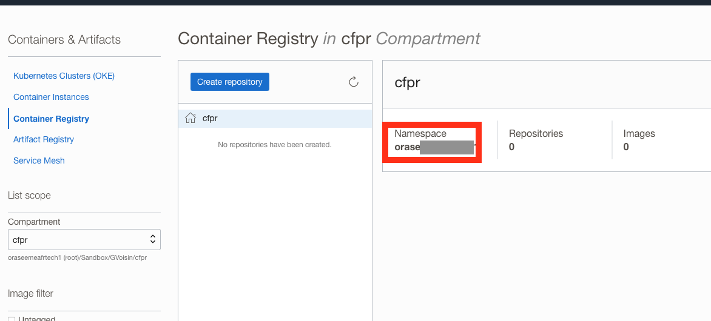
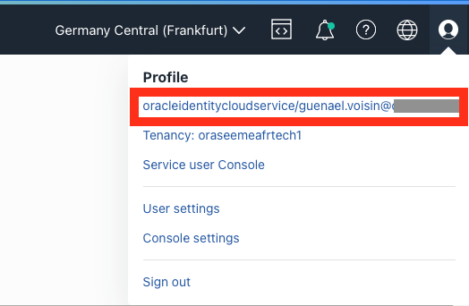
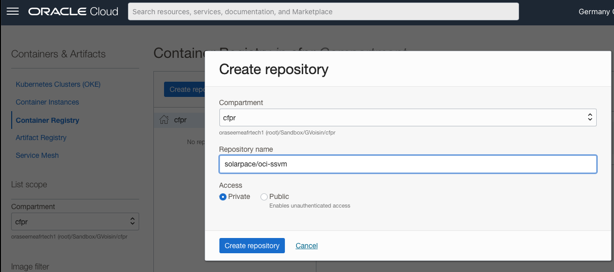
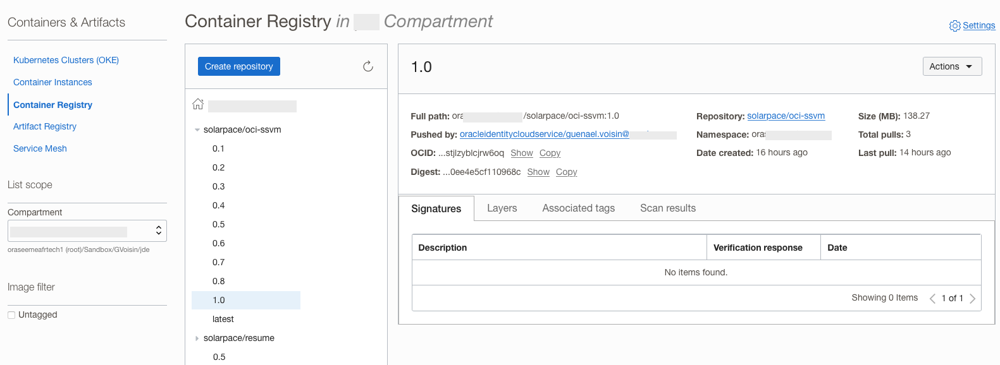
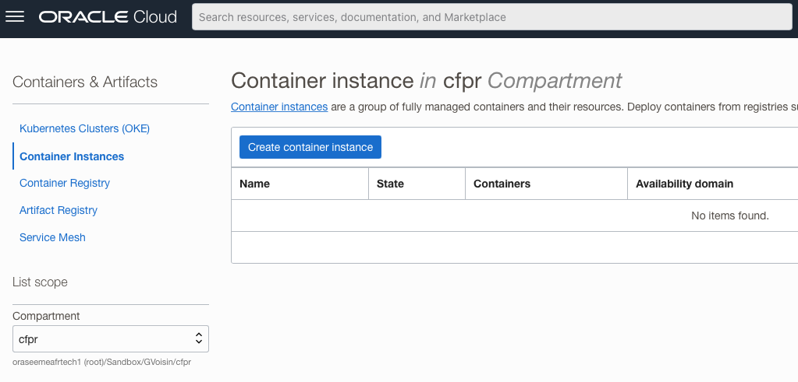
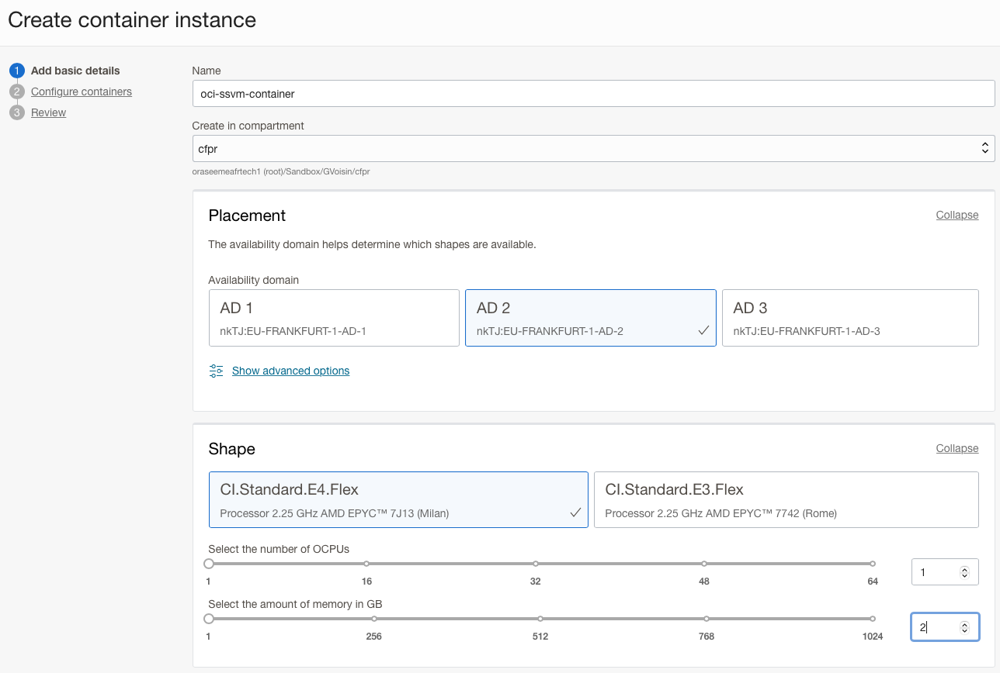
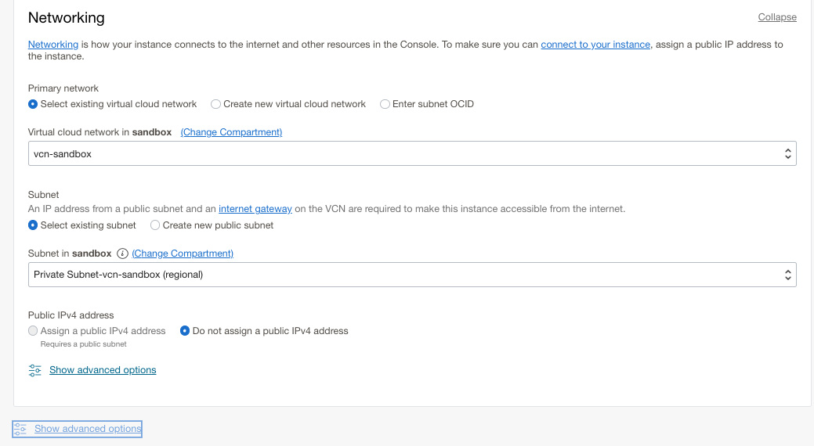
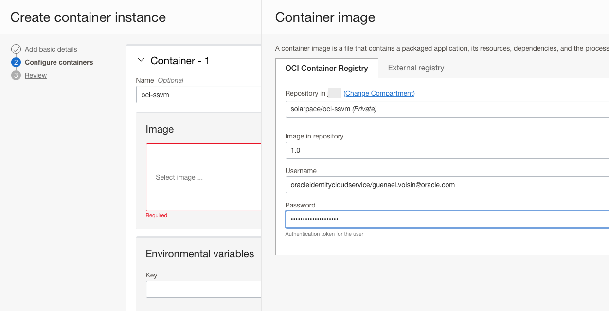
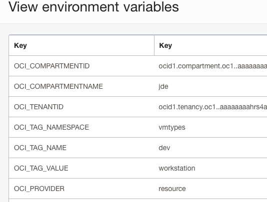
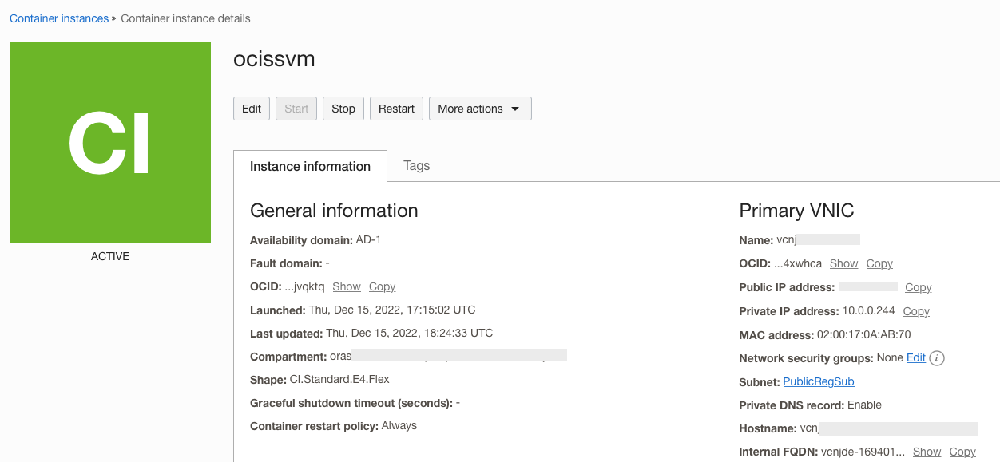

# oci-ssvm : OCI Self-Service VM Manager


Welcome to the VM Self-Service Application for OCI (Oracle Cloud Infrastructure).
This application allows key users/developers to start an OCI instance on-demand through a simple Web application which runs on OCI.

With this applications, users don't need any OCI console access; the application only lists the OCI instances relevant for Self-Service (filtered by OCI Tags). They can start or stop the instance and get the IP address to connect to the instance using RDP or ssh.
Combined with the [OCI-AutoScale](https://github.com/AnykeyNL/OCI-AutoScale) script, you can also schedule an automatic shutdown of those instances every night.

## Features

* Allow users to start some OCI instances on-demand
* user can select instances across compartments
* only instances with specific Tags are visible in the application (tags have to be defined in OCI and in ENV variables)
* the application should be used alongside [OCI-AutoScale](https://github.com/AnykeyNL/OCI-AutoScale) to schedule the automatic shutdown of the VM every night or according to the users' requirements

## Deployments

There are now 2 ways to deploy the application on OCI: you can either deploy it on a single VM instance or use the new Container Instance. Select the right section for the deployment you choose.
### Install application into (free-tier) Oracle Linux Instance

* create a free-tier compute instance using the Oracle Linux 9.0; for obvious security reasons, the instance **must** be in a private subnet
  * you can use an ARM shape with minimum OCPU and memory
* Create a Dynamic Group called dg_ocissvm and add the OCID of your instance to the group, using this command:
  
  ```
   ANY {instance.id = 'your_OCID_of_your_Compute_Instance'}
  ```

* Create a root level policy, giving your dynamic group permission to manage all OCI instances in tenancy or in selected compartments if you only want the application to manage instances in a limited list of compartments:

   ```
   allow dynamic-group dg_ocissvm to manage instance-family  in tenancy  
   ```

   or

   ```
   allow dynamic-group dg_ocissvm to manage instance-family  in compartment 'your Compartment 1' 
   allow dynamic-group dg_ocissvm to manage instance-family  in compartment 'your Compartment 2' 
    ...
   ```

* Create a new Tag NameSpace which allows the application to filter the instances available for Self-Service. The Tag structure currently available is (should be more dynamic in the future):
  * Tag Namespace : **vmtypes**
    * Tag Name    : **dev**
      * Tag Value : **workstation**


> you still can change the Tag Namespace, name and value in the start.sh script after initial installation:

```shell
    export OCI_TAG_NAMESPACE=vmtypes
    export OCI_TAG_NAME=dev
    export OCI_TAG_VALUE=workstation
```

* Login to your instance using an SSH connection
* run the following commands:
  * wget https://raw.githubusercontent.com/gvoisin/oci-ssvm/main/install.sh
  * bash install.sh
    * enter the default parameters

    ```shell
    Enter Your Tenancy OCID: ocid1.tenancy.oc1..xxxxxxx
    Enter Your default Compartment Name: mycompartment
    ```

    * the script will then get the compartment ID, build and start the application

    ```shell
    --------------------------------------------------------------------------------
    ---- --- OCI configuration:
    --------------------------------------------------------------------------------
    2022-09-07 18:45:34 [INFO]  OCI_COMPARTMENTID=ocid1.compartment.oc1..xxx
    2022-09-07 18:45:34 [INFO]  OCI_COMPARTMENTNAME=dev
    2022-09-07 18:45:34 [INFO]  OCI_TENANTID=ocid1.tenancy.oc1..aaaxxxxxx
    2022-09-07 18:45:34 [INFO]  OCI_TAG_NAMESPACE=vmtypes
    2022-09-07 18:45:34 [INFO]  OCI_TAG_NAME=dev
    2022-09-07 18:45:34 [INFO]  OCI_TAG_VALUE=workstation
    2022-09-07 18:45:34 [INFO]  OCI_PROVIDER=instance
    2022-09-07 18:45:34 [INFO]
    --------------------------------------------------------------------------------
    ---- 🏎 -- Building the application ...
    --------------------------------------------------------------------------------

    Done in 590ms.
    --------------------------------------------------------------------------------
    ---- 🏎 -- Starting the application ...
    --------------------------------------------------------------------------------
    Remix App Server started at http://localhost:3000 (http://10.1.0.14:3000)
    ```

The instance is now all setup and the application is available at the URL http://instance-ip:3000/

You can restart it manually if need by running **start.sh**


### Install application into OCI Container Instance (🖐️  new OCI feature)

OCI Container Instances have been newly released (Dec 2022) and the application can also be deployed as a Docker container instance in just a few steps:
1. build the container using the [Dockerfile](./Dockerfile)
2. tag and push the docker image in OCI Container Registry
3. create a new container instance with the newly created image


### Build the container instance

Run the docker build using the Docker file provided:

```
docker build -f ./Dockerfile . -t oci-ssvm:1.0
```

### Tag and Push the docker image in OCI Container Registry

First, you would need to create an Auth Token for your OCI user; see the documentation here: [Generating an Auth Token to Enable Login to Oracle Cloud Infrastructure Registry](https://docs.oracle.com/en-us/iaas/Content/Functions/Tasks/functionsgenerateauthtokens.htm)

In the OCI Console, go to the Container Registry under **Developer Services** and pick your OCI Namespace:

  

Select the region where you want to store your container images and pick the region key accordingly; see [Regions and Availability Domains](https://docs.oracle.com/en-us/iaas/Content/General/Concepts/regions.htm)

For example, Frankfurt region would have the **fra** key.

In the top right of the OCI console, click the **Profile** icon to get your full username:

  

With those information, you can now connect to your OCI Registry; you will be prompted for the password; enter the Auth Token:

```
docker login REGION-KEY.ocir.io --username "OCI-NAMESPACE/YOUR-OCI-USERID"
```

For example, a login connection for Frankfurt with a IDC userid:

```
docker login fra.ocir.io --username "oraseemexxxx/oracleidentitycloudservice/guenael.voisin@mydomain.com"
Password: xxxxx
Login Succeeded!
```

Before pushing your image to the OCI registry, you would first need to create the target repository in the selected compartment (If not, the repository would be created in the root compartment).
You can create it using the OCI console under the **Developer Services** section:



| Note: if you have the OCI Cli installed on your laptop (or by using the OCI Cloud Shell), you could also create it automatically:

```
oci artifacts container repository create --display-name solarpace/oci-ssvm --compartment-id ocid1.compartment.oc1..aaaxxxxxxxxxxxxxxxxx
```


You are now ready to tag your Container image and push it to your OCI registry:

```
docker tag oci-ssvm:1.0 REGION-KEY.ocir.io/OCI-NAMESPACE/solarpace/oci-ssvm:1.0
docker push REGION-KEY.ocir.io/OCI-NAMESPACE/solarpace/oci-ssvm:1.0
```

For example:

```
docker tag oci-ssvm:1.0 fra.ocir.io/oraxxxxxx/solarpace/oci-ssvm:1.0
docker push fra.ocir.io/oraxxxxx/solarpace/oci-ssvm:1.0
```

The Container image is now stored in you OCI Container repository:



It is ready to be deployed inside a Container Instance.

### Create the Container Instance


 You can check the following blog post to get more info about container instance deployment: [Getting started with OCI Container Instances](https://blogs.oracle.com/post/getting-started-with-oci-container-instances)

In the OCI Console, go to the **Container Instance** menu under **Developer Services**

  

Click **Create Container Instance** and provide container instance details:



In the **Networking** section, select a Private Network and make sure port **8080** is opened in the Security Rules (or Network Security Group rules):

  

Next, configure the container by selecting the container image you pushed; enter you Username and Auth Token:

  

Last step, configure environment variables according to your OCI configuration:

  

* Note: OCI_PROVIDER could have 3 distinct values:
  * file: using the local config file for authentication
  * instance: using instancePrincipals for authentication (when deploying on VM instance)
  * resource: using resourcePrincipals for authentication (when deploying on Container instance)

Review the information and click **Create**. Your Container instance should be in **Active** State in just a few seconds.

From the **Container Instance Details** page, pick the following information:
* Container OCID
* Container IP address



Create a Dynamic Group called dg_ocissvm and add the OCID of your container instance to the group, using this syntax:
  
  ```
   ANY {resource.id = 'ocid1.computecontainer.oc1.eu-frankfurt-1.anthxxxxxxxxxx'}
  ```

Create a root level policy, giving your dynamic group permission to list compartments and manage all Compute instances in tenancy or in selected compartments if you only want the application to manage instances in a limited list of compartments:

   ```
   allow dynamic-group dg_ocissvm to manage instance-family stances in tenancy  
   ```

   or

   ```
   allow dynamic-group dg_ocissvm to manage instance-family  in compartment 'your Compartment 1' 
   allow dynamic-group dg_ocissvm to manage instance-family  in compartment 'your Compartment 2' 
    ...
   ```

The Container instance is now all setup and the application is available at the URL http://container-instance-ip:8080/


