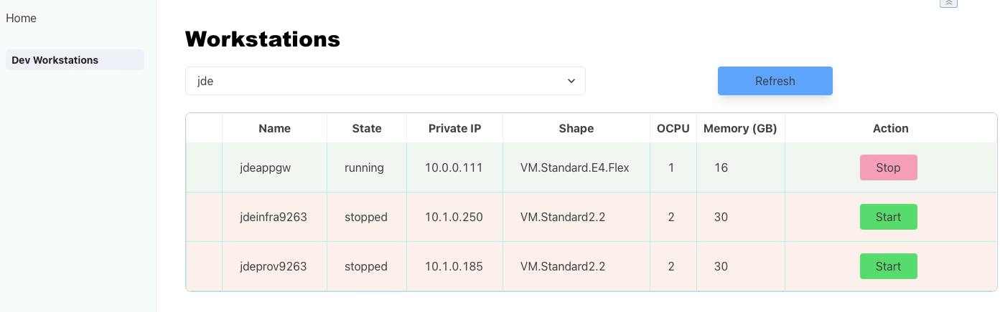
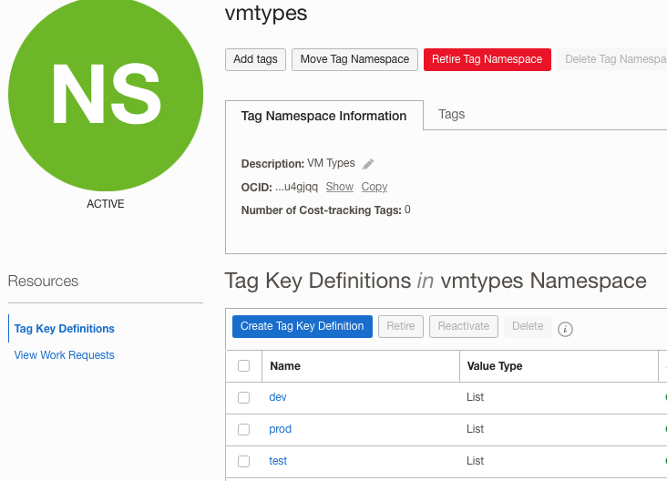

# oci-ssvm : OCI Self-Service VM Manager



Welcome to the VM Self-Service Application for OCI (Oracle Cloud Infrastructure).
This application allows key users/developers to start an OCI instance on-demand through a simple Web application which runs on OCI.

With this applications, users don't need any OCI console access; the application only lists the OCI instances relevant for Self-Service (filtered by OCI Tags). They can start or stop the instance and get the IP address to connect to the instance using RDP or ssh.
Combined with the [OCI-AutoScale](https://github.com/AnykeyNL/OCI-AutoScale) script, you can also schedule an automatic shutdown of those instances every night.

## Features

* Allow users to start some OCI instances on-demand
* user can select instances across compartments
* only instances with specific Tags are visible in the application (tags have to be defined in OCI and in ENV variables)
* the application should be used alongside [OCI-AutoScale](https://github.com/AnykeyNL/OCI-AutoScale) to schedule the automatic shutdown of the VM every night or according to the users' requirements

## Install application into (free-tier) Oracle Linux Instance

* create a free-tier compute instance using the Oracle Linux 9.0; for obvious security reasons, the instance **must** be in a private subnet
  * you can use an ARM shape with minimum OCPU and memory
* Create a Dynamic Group called dg_ocissvm and add the OCID of your instance to the group, using this command:
  
  ```
   ANY {instance.id = 'your_OCID_of_your_Compute_Instance'}
  ```

* Create a root level policy, giving your dynamic group permission to manage all resources in tenancy or in selected compartments if you only want the application to manage instances in a limited list of compartments:

   ```
   allow dynamic-group dg_ocissvm to manage all-resources in tenancy  
   ```

   or

   ```
   allow dynamic-group dg_ocissvm to manage all-resources in compartment 'your Compartment 1' 
   allow dynamic-group dg_ocissvm to manage all-resources in compartment 'your Compartment 2' 
    ...
   ```

* Create a new Tag NameSpace which allows the application to filter the instances available for Self-Service. The Tag structure currently available is (should be more dynamic in the future):
  * Tag Namespace : **vmtypes**
    * Tag Name    : **dev**
      * Tag Value : **workstation**



> you still can change the Tag Namespace, name and value in the start.sh script after initial installation:

```shell
    export TAG_NAMESPACE=vmtypes
    export TAG_NAME=dev
    export TAG_VALUE=workstation
```

* Login to your instance using an SSH connection
* run the following commands:
  * wget https://raw.githubusercontent.com/gvoisin/oci-ssvm/main/install.sh
  * bash install.sh
    * enter the default parameters

    ```shell
    Enter Your Tenancy OCID: ocid1.tenancy.oc1..xxxxxxx
    Enter Your default Compartment Name: mycompartment
    ```

    * the script will then get the compartment ID, build and start the application

    ```shell
    --------------------------------------------------------------------------------
    ---- --- OCI configuration:
    --------------------------------------------------------------------------------
    2022-09-07 18:45:34 [INFO]  DEFAULT_COMPARTMENTID=ocid1.compartment.oc1..xxx
    2022-09-07 18:45:34 [INFO]  DEFAULT_COMPARTMENTNAME=dev
    2022-09-07 18:45:34 [INFO]  DEFAULT_TENANTID=ocid1.tenancy.oc1..aaaxxxxxx
    2022-09-07 18:45:34 [INFO]  TAG_NAMESPACE=vmtypes
    2022-09-07 18:45:34 [INFO]  TAG_NAME=dev
    2022-09-07 18:45:34 [INFO]  TAG_VALUE=workstation
    2022-09-07 18:45:34 [INFO]
    --------------------------------------------------------------------------------
    ---- 🏎 -- Building the application ...
    --------------------------------------------------------------------------------

    Done in 590ms.
    --------------------------------------------------------------------------------
    ---- 🏎 -- Starting the application ...
    --------------------------------------------------------------------------------
    Remix App Server started at http://localhost:3000 (http://10.1.0.14:3000)
    ```

The instance is now all setup and the application is available at the URL http://instance-ip:3000/

You can restart it manually if need by running **start.sh**
